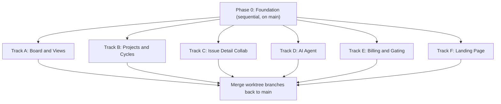

# Linear Clone — Foundation First, Then Parallel Agent Tracks

## Confirmed decisions (from brainstorm)

- **Stack**: Next.js 16 (App Router), Convex, Clerk (auth + billing), shadcn/ui, Tailwind 4, pnpm. Linear-style dense UI with light/dark mode (`next-themes`).
- **Tenancy**: Clerk Organization = workspace; Teams inside orgs (each with issue prefix, e.g. ENG-123); Clerk default roles (admin/member); member invites via Clerk.
- **Architecture (Approach A)**: Clerk is source of truth; webhooks sync users/orgs/memberships/subscriptions into Convex mirror tables. All Convex functions go through custom org-scoped auth wrappers (convex-helpers `customQuery`/`customMutation`).
- **Billing**: 3 org plans — Free (3 seats, 2 projects, 100 issues, no AI), Pro (per-seat, AI included, 50 AI msgs/user/day), Enterprise (flat price, unlimited seats, unlimited AI). **Custom pricing table** built with shadcn cards + Clerk's `<CheckoutButton>`, `<PlanDetailsButton>`, `<SubscriptionDetailsButton>` from `@clerk/nextjs/experimental` (NOT `<PricingTable />`). Gate with `has({ plan })` / `has({ feature })` in UI and synced plan on the org doc in Convex. Pin `@clerk/nextjs` + `clerk-js` (billing is beta).
- **AI agent (Pro/Enterprise)**: Convex Agent component + OpenAI. Tools: create/update/search issues, cycle summaries, project status, list members. Plus triage assist (auto-suggest labels/priority), semantic duplicate detection (vector index), standup/cycle reports. Rate-limited via Convex Rate Limiter component.
- **Features**: issues (status/priority/assignee/estimates/due dates/sub-issues/relations/attachments/@mentions), Kanban board + list views, projects, cycles, labels/filters/saved views, comments + activity feed, full-text search, keyboard shortcuts (Cmd+K palette), presence (Convex Presence component).
- **CLI access verified**: Convex CLI 1.41.0 (logged in), Clerk CLI 1.4.0 (authenticated as [team@papareact.com](mailto:team@papareact.com), project not yet linked).

## Why this structure

Everything that parallel agents would conflict over lives in the Foundation: `package.json` deps, `convex/schema.ts` (complete upfront), `convex.config.ts` (all components registered), auth wrappers, app shell/nav, theme, and shared UI primitives. After the Foundation merges to `main`, each track only **adds** its own files (own route folders, own `convex/*.ts` function files, own component folders) plus one-line registrations in designated registry files.



## Phase 0 — Foundation (built first, sequentially)

### 0.1 Dependencies & tooling (ALL deps now, so no track touches package.json)

`convex`, `@clerk/nextjs` (pinned), `convex-helpers`, `@convex-dev/agent`, `@convex-dev/rate-limiter`, `@convex-dev/presence`, `ai` + `@ai-sdk/openai`, `next-themes`, shadcn init + full component set, drag-drop lib (`@dnd-kit`), `cmdk`. Set up `@convex-dev/eslint-plugin`. Init git repo + first commit.

### 0.2 Clerk setup (via Clerk CLI, acting on user's behalf)

- `clerk apps create` (or link existing) + `clerk link` + `clerk env pull`.
- `clerk enable billing --for org`; seed Pro/Enterprise org plans + features (`ai_agent`, `unlimited_seats`, etc.) via `clerk config patch` (dry-run first). Free tier = default `free_org` plan with seat limit 3.
- Enable organizations; configure JWT template named `convex`.
- `clerkMiddleware` in [proxy.ts/middleware.ts], `<ClerkProvider>` + `ConvexProviderWithClerk` in providers.

### 0.3 Convex backend core

- `npx convex dev` to provision dev deployment; `convex/auth.config.ts` pointing at Clerk issuer.
- **Complete `convex/schema.ts`** with ALL tables + indexes upfront: `users`, `organizations` (incl. `plan`), `members`, `teams`, `issues` (incl. search index + vector index + `sortOrder`), `labels`, `issueLabels`, `issueRelations`, `comments`, `activity`, `projects`, `cycles`, `attachments`, `views`.
- `convex.config.ts` registering agent, rateLimiter, presence components.
- `convex/lib/auth.ts` + `convex/lib/customFunctions.ts`: `authedQuery/Mutation`, `orgQuery/Mutation`, `orgAdminMutation` (resolve user, verify org membership from synced tables, attach `ctx.user`, `ctx.org`).
- `convex/http.ts` webhook endpoint (Svix verification) + `convex/webhooks.ts` internal mutations syncing: `user.*`, `organization.*`, `organizationMembership.*`, `subscription.*`/`subscriptionItem.*` (Clerk event names, plan slug onto org doc).
- `convex/lib/limits.ts`: plan-limit helpers (seat/project/issue caps) used by all tracks.
- Minimal `convex/teams.ts` + `convex/issues.ts` (core CRUD with per-team issue numbering) — the working vertical slice tracks build on.

### 0.4 App shell & design system

- Route groups: `app/(marketing)/` (placeholder landing, `/pricing` placeholder), `app/(app)/[orgSlug]/` with authenticated layout: sidebar (org switcher, teams list, nav), top bar, theme toggle.
- Org onboarding flow (create org / accept invite) using Clerk components.
- Shared primitives in `components/shared/`: status/priority icons, user avatar, label chip, issue row, panel layout.
- Command palette skeleton (`cmdk`) + keyboard shortcut provider with a **registry pattern** (tracks register their own shortcuts/commands in their own files; one import line each in a designated registry file).
- Basic issue list + issue detail page skeleton with **slot components** (e.g. `IssueDetailSidebar`, `IssueDetailTabs`) that tracks extend.

### 0.5 Parallel-work conventions

- Write `AGENTS.md`: file-ownership map per track, "add files, don't edit shared files" rule, the registry files that ARE allowed (one-line additions), commit conventions.
- Write design doc to `docs/specs/2026-06-12-linear-clone-design.md`.
- Commit foundation to `main`.

## Parallel Tracks (each = one git worktree + branch + agent)

- **Track A — Board & Views**: Kanban board with @dnd-kit drag-drop + fractional `sortOrder`, list view enhancements, filtering UI, saved views, full-text search page, remaining keyboard shortcuts. Owns `app/(app)/[orgSlug]/team/[teamId]/board/`, `components/board/`, `convex/views.ts`, `convex/search.ts`.
- **Track B — Projects & Cycles**: project CRUD/progress pages, cycles with auto-numbering and date ranges, assignment of issues to projects/cycles. Owns `app/(app)/[orgSlug]/projects/`, `.../cycles/`, `components/projects/`, `convex/projects.ts`, `convex/cycles.ts`.
- **Track C — Issue Detail Collaboration**: comments with @mentions, activity feed (event log writes added via internal helper), sub-issues UI, issue relations, attachments (Convex storage), presence (online avatars + viewing indicators). Owns `components/issue-detail/`, `convex/comments.ts`, `convex/activity.ts`, `convex/attachments.ts`, `convex/presenceFns.ts`; fills the foundation's detail-page slots.
- **Track D — AI Agent**: Agent component setup with OpenAI, org-scoped tools, chat panel UI, triage assist (embedding + duplicate detection on issue create via scheduled internal action), cycle/standup report generation, rate limiting (50/day Pro, unlimited Enterprise), plan enforcement in every agent entrypoint. Owns `convex/agent/`, `components/ai/`, `app/(app)/[orgSlug]/ai/`.
- **Track E — Billing & Gating**: custom pricing page (3 shadcn plan cards, monthly/annual toggle, feature comparison) using `<CheckoutButton>`/`<PlanDetailsButton>` with custom child buttons wrapped in `<Show when="signed-in">` + `auth.orgId` guard; org billing settings with `<SubscriptionDetailsButton>` + current-plan summary; enforce free-tier caps (seats/projects/issues) using `convex/lib/limits.ts`; upgrade prompts throughout. Owns `app/(marketing)/pricing/`, `app/(app)/[orgSlug]/settings/billing/`, `components/billing/`, `lib/plans.ts` (plan IDs + marketing copy config).
- **Track F — Landing Page**: marketing landing page in the Linear aesthetic (hero, feature sections, CTA), light/dark aware. Owns `app/(marketing)/` (except pricing), `components/marketing/`.

## Worktree demo workflow (for the stream)

```bash
git worktree add ../vector-track-a -b track/board-views
git worktree add ../vector-track-d -b track/ai-agent   # etc.
```

- One agent per worktree; each gets its track brief from `AGENTS.md`.
- **Convex dev note**: only the main worktree runs `npx convex dev` (it pushes functions to the shared dev deployment). Track agents write code + typecheck (`tsc --noEmit`, `pnpm lint`); functional verification happens after merging into main, or a track can temporarily run `convex dev` solo. (Alternative to showcase: `CONVEX_AGENT_MODE=anonymous` for isolated deployments per worktree.)
- Merge order suggestion: A → C → B → E → D → F (most-shared-surface first), resolving the rare registry-file conflicts trivially.

## Verification

- Foundation: sign up → create org → invite member → create team → create/view issue, live-updating across two browsers; webhook sync visible in Convex dashboard.
- Per track: typecheck + lint clean; post-merge smoke test of the track's feature.
- Billing: dev-instance checkout via Clerk's dev gateway; `has({ plan: 'pro' })` unlocks AI panel.
